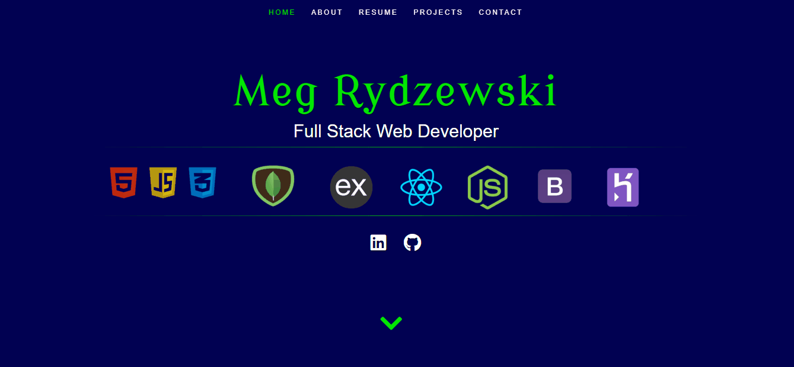

Meg Rydzewski Web Development
-----------------------------

This is my professional website. It was created using the following technologies: React, jQuery, HTML, CSS.  On landing on the home page, you have the option to scroll through the pages or use the nav buttons. All content is dynamically rendered from a json file. The about page includes an option to download my resume from Google.  The portfolio page includes some of my most recent projects. Upon hover on the images, a modal explains which technologies were utilized and prompts the viewer to see the code on GitHub. Upon click, the viewer can click through to a new tab and experience the app.  

This app was deployed via Heroku here: https://mmrydz.herokuapp.com/.

Demo
---- 

Try it for yourself!
--------------------
You are welcome to clone this from my repo and modify it for yourself.  Just install using Create-React-App. Then 'npm install' and modify away. To run it, type 'nmp start' in your terminal.

